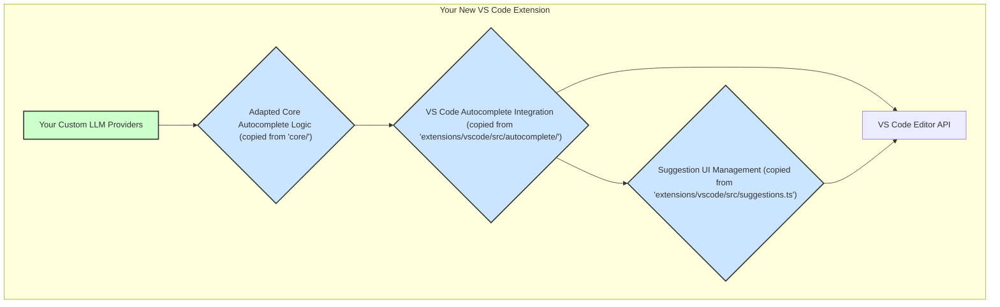

# Autocomplete Integration Plan

**Overall Goal:** To extract the core autocomplete functionality (generation and VS Code UI interaction) from the "Continue" repository, adapt it for your custom LLM providers, and integrate it into a new VS Code extension by copying the relevant source files.

**High-Level Component Interaction (Conceptual):**

- **Your Custom LLM Providers**: This is the new component you will build/integrate.
- **Adapted Core Autocomplete Logic**: This will be based on `core/autocomplete/CompletionProvider.ts`, modified to use your LLM providers.
- **VS Code Autocomplete Integration**: This will be based on `extensions/vscode/src/autocomplete/completionProvider.ts`, connecting the core logic to VS Code's `InlineCompletionItemProvider` API.
- **Suggestion UI Management**: This will be based on `extensions/vscode/src/suggestions.ts` for handling how suggestions are displayed and interacted with.

**Detailed Plan:**

**Phase 1: In-Depth Code Analysis and Dependency Mapping (within the "Continue" repo)**
This phase involves understanding the key files and their connections.

1.  **Analyze Core Autocomplete Logic:**
    - Read and understand `core/autocomplete/CompletionProvider.ts`. Focus on:
        - How it constructs prompts or prepares data for the LLM.
        - How it processes LLM responses to generate suggestions.
        - Its internal methods and data structures.
        - Its dependencies (other files in `core/` or external npm packages).
2.  **Analyze VS Code Integration Layer:**
    - Read and understand `extensions/vscode/src/autocomplete/completionProvider.ts`. Focus on:
        - How it instantiates and uses the core `CompletionProvider`.
        - How it implements the `vscode.InlineCompletionItemProvider` interface methods (e.g., `provideInlineCompletionItems`).
        - Its dependencies, including VS Code APIs and other local files.
3.  **Analyze Suggestion UI Management:**
    - Read and understand `extensions/vscode/src/suggestions.ts`. Focus on:
        - How it renders suggestions in the editor.
        - How it handles commands for accepting, rejecting, or navigating suggestions.
        - Its dependencies, particularly VS Code APIs.
4.  **Identify Supporting Files & Initialization:**
    - Investigate other files in `extensions/vscode/src/autocomplete/` (e.g., `lsp.ts`, `recentlyEdited.ts`, `RecentlyVisitedRangesService.ts`, `statusBar.ts`) to determine their role and if they are essential for the autocomplete functionality you want to replicate.
    - Examine `extensions/vscode/src/extension.ts` to understand how the autocomplete services and commands are registered and initialized during extension activation.
    - Check if `extensions/vscode/src/VsCodeIde.ts` is used by the autocomplete components for any essential IDE interactions.
5.  **Compile Lists:**
    - Create a definitive list of all TypeScript files to be copied.
    - List all external npm dependencies required by these files (check `package.json` files in `core/` and `extensions/vscode/`).

**Phase 2: Setting Up Your New VS Code Extension Project**

1.  **Create New Extension:** Use official tools like `yo code` (Yeoman generator for VS Code extensions) to scaffold a new TypeScript-based VS Code extension.
2.  **Project Setup:**
    - Initialize `tsconfig.json` appropriately.
    - Set up `package.json` for your new extension.
    - Optionally, set up linting (ESLint) and formatting (Prettier) similar to the "Continue" project for consistency if desired.

**Phase 3: Code Integration and Adaptation**

1.  **Copy Files:**
    - Carefully copy the identified files from the "Continue" repository (Phase 1.5) into your new extension's source directory. Try to maintain a logical subdirectory structure (e.g., `src/core-logic/`, `src/vscode-integration/`).
2.  **Install Dependencies:**
    - Add the npm dependencies identified in Phase 1.5 to your new extension's `package.json`.
    - Run `npm install` (or `yarn install`).
3.  **Adapt and Modify:**
    - **Update Import Paths:** Systematically go through the copied files and update all `import` statements to reflect their new locations within your project.
    - **Integrate Custom LLM Providers:** This is a critical step. Modify the copied core autocomplete logic (likely originating from `core/autocomplete/CompletionProvider.ts`) to call your custom LLM provider functions/classes instead of the original LLM interaction points. You'll need to define clear interfaces for how your LLM providers will be called.
    - **Register Components:** In your new extension's main activation file (e.g., `extension.ts`), register the `InlineCompletionItemProvider` and any commands related to suggestions (from the copied `suggestions.ts`). This will involve adapting code found in the original `extensions/vscode/src/extension.ts`.
    - **Resolve Conflicts & Errors:** Address any TypeScript errors, runtime errors, or logical issues that arise from the copying and modification process. This will likely be an iterative process.

**Phase 4: Testing and Refinement**

1.  **Launch & Debug:** Run your new extension in a VS Code Extension Development Host.
2.  **Test Autocomplete:** Thoroughly test the autocomplete functionality in various scenarios (different file types, different code contexts).
3.  **Verify LLM Integration:** Ensure your custom LLM providers are being called correctly and that their responses are processed as expected.
4.  **Iterate:** Debug any issues, refine the integration, and improve performance or behavior as needed.
